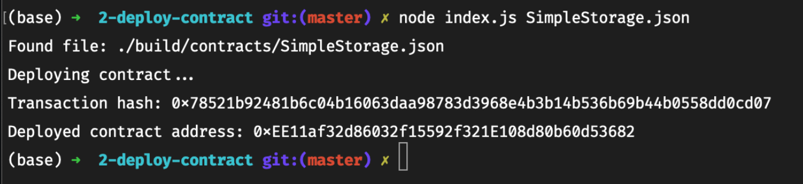

## Gitcoin: 2) Deploy A Simple Ethereum Smart Contract On Polyjuice

1. A screenshot of the console output immediately after you have successfully deployed a smart contract.
   

2. The transaction hash from the contract deployment (in text format).
   `0x78521b92481b6c04b16063daa98783d3968e4b3b14b536b69b44b0558dd0cd07`

3. The deployed contract address from the contract deployment (in text format).
   `0xEE11af32d86032f15592f321E108d80b60d53682`
