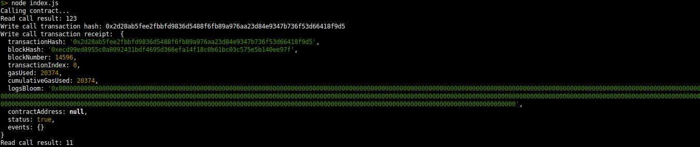

## A screenshot of the console output


## Transaction hash from the console output.
`0x2d28ab5fee2fbbfd9836d5488f6fb89a976aa23d84e9347b736f53d66418f9d5`

## The contract address that I called.
`0xF426B10035e50F8b2168139BE7CB281d5Fb0AaC5`

## The ABI for contract I made a call on.
```json
[
	{
		"inputs": [],
		"stateMutability": "payable",
		"type": "constructor"
	},
	{
		"inputs": [
			{
				"internalType": "uint256",
				"name": "x",
				"type": "uint256"
			}
		],
		"name": "set",
		"outputs": [],
		"stateMutability": "payable",
		"type": "function"
	},
	{
		"inputs": [],
		"name": "get",
		"outputs": [
			{
				"internalType": "uint256",
				"name": "",
				"type": "uint256"
			}
		],
		"stateMutability": "view",
		"type": "function"
	}
]
```
