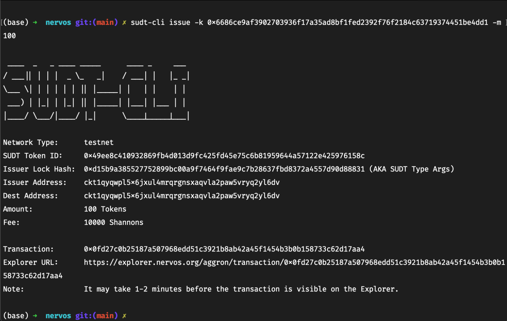
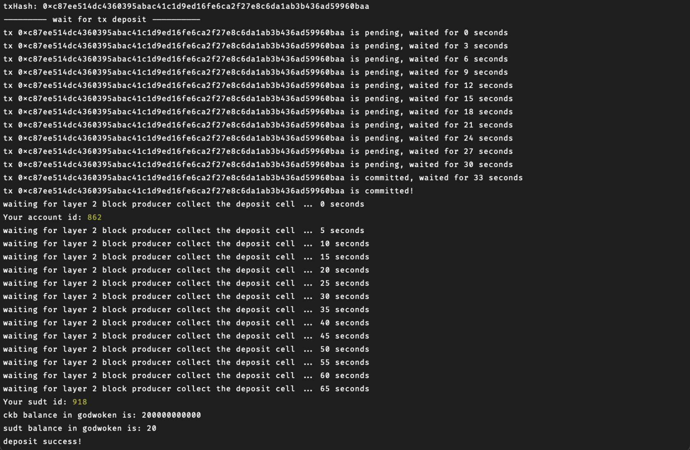

## Gitcoin: 4) Issue An SUDT Token On Layer 1 And Deposit It To Layer 2

1. A link to the Layer 1 address you funded on the Testnet Explorer.
   https://explorer.nervos.org/aggron/address/ckt1qyqwpl5x6jxul4mrqrgnsxaqvla2paw5vryq2yl6dv

2. A screenshot of the console output immediately after using sudt-cli to create your SUDT tokens on Layer 1.
   

3. A link to the transaction ID created by sudt-cli on the Testnet Explorer.
   https://explorer.nervos.org/aggron/transaction/0xc87ee514dc4360395abac41c1d9ed16fe6ca2f27e8c6da1ab3b436ad59960baa

4. A screenshot of the console output immediately after you have successfully submitted a deposit to Layer 2 using the account-cli tool.
   

5. The SUDT ID from the console output after executing the deposit script (in text format).
   `918`
