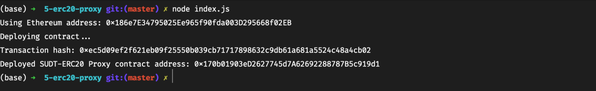
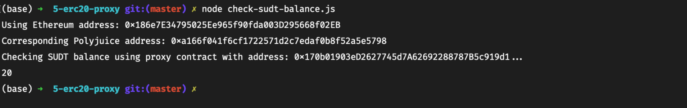

## Gitcoin: 5) Deploy The ERC20 Proxy Contract For The Deposited SUDT

1. A screenshot of the console output immediately after deploying smart contract.
   

2. The address of the ERC20 Proxy Contract you deployed (in text format).
   `0x170b01903eD2627745d7A62692288787B5c919d1`

3. A screenshot of the console output immediately after checking your SUDT balance.
   

4. The Ethereum address that was checked (in text format).
   `0x186e7E34795025Ee965f90fda003D295668f02EB`
