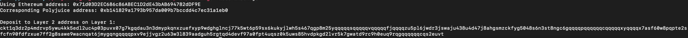

1. A screenshot of the console output immediately after you have successfully generated your Deposit Receiver Address.

2. Your Deposit Receiver Address (in text format).

ckt1q3dz2p4mdrvp5ywu4kk5edl2uc4p03puvx07g7kgqdau3n3dmypkqnxzuefxyp9wdghglncj77k5wt6p59sx6kukyjlwh5s467qgp8m25yqqqqqsqqqqqvqqqqqfjqqqqzu5pl6jwdr3jswaju438u4d47j8ahgsmzckfyg5048s6n3st8ngc6gqqqqpqqqqqqcqqqqqxyqqqqx7asf60w8pqpte2sfcfn90fdfzxue7ff2g8sawe9wacnqat6jmygqngqqqqpxv9ejjvgz2u63w3l839aadguh5rgtqd4devf97a0fpt4uqsz0k5uws85hvdpkgd2lvr5k7gwatd9rc9h0euq9rqgqqqqqqcqs2euvt

3. The Ethereum address used to generate the Deposit Receiver Address (in text format).

0x71d03D2EC686c86ABEC1D2dE43bAB694782dDF9E

4. A link to the Etherscan explorer for the successful Force Bridge transaction. This can be found on Force Bridge under History→Succeed.

https://rinkeby.etherscan.io/tx/0x9d06c20cab17fdc777781057f1ca05b6966b012cdfeccf62c7564b09d75ed93a

5. A link to the Nervos explorer for the successful Force bridge transaction. This can be found on Force Bridge under History→Succeed.

https://explorer.nervos.org/aggron/transaction/0x886a263e2b083da1c059eba751b2962b74c430a13d62a60433a462c34ec5d88f
